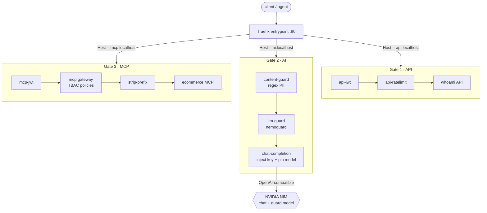
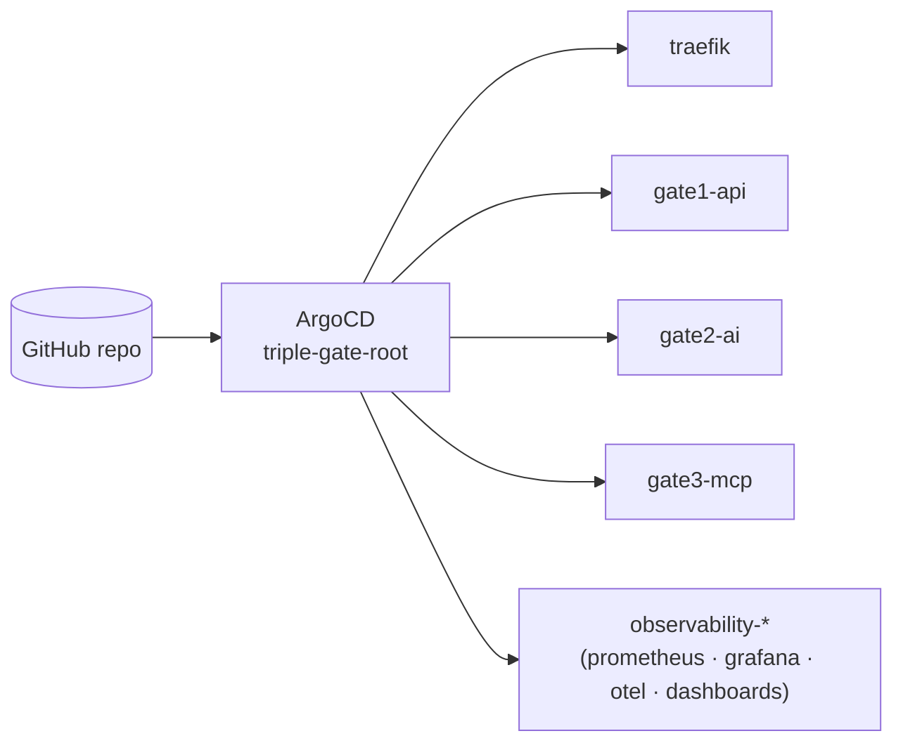
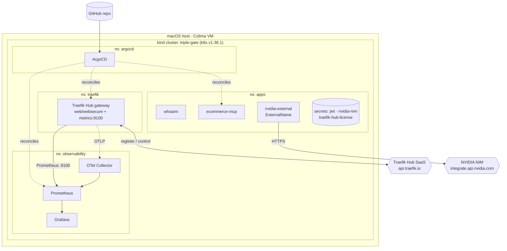

# Architecture

The PoC is one gateway enforcing **three gates** in front of three workload classes (a REST API, an LLM, and an
MCP/agent server), all reconciled from Git by ArgoCD on a single-node homelab. This page is the map: what each gate enforces, how a request flows
through them as **defense in depth**, the GitOps control loop, and the homelab topology
(including what leaves the perimeter, which is the crux of the [Evaluation](evaluation.md)).

## The three gates

| Gate | Host route | Enforces | Built from |
| --- | --- | --- | --- |
| **1. API** | `api.localhost` | Identity (JWT) + abuse control (rate limit) | [Gate 1](gates/api-gateway.md) |
| **2. AI** | `ai.localhost` | PII block, LLM safety, model/cost governance | [Gate 2](gates/ai-gateway.md) |
| **3. MCP** | `mcp.localhost` | Per-identity, per-tool authorization (TBAC) | [Gate 3](gates/mcp-gateway.md) |

Each gate is an `IngressRoute` plus an ordered chain of middlewares; the route's **Host**
selects the gate. The same Traefik Hub instance serves all three.

## Request flow: defense in depth

A request is screened by an *ordered chain*, and each gate refuses a **different class**
of abuse. A step that slips past one is still caught by the next, and crucially, the
last gate (MCP/TBAC) holds even if an attacker fully controls the agent's reasoning.

| Attack | Stopped at | Why the others can't see it |
| --- | --- | --- |
| Anonymous / forged token | **Gate 1** (or 3) JWT | AI/MCP gates never receive the request |
| Exfiltrating PII via a prompt | **Gate 2** Content Guard | A valid token passes Gate 1; regex catches the pattern |
| Jailbreak to harmful output | **Gate 2** LLM Guard | Deterministic regex can't judge intent; the safety model can |
| Agent coerced into a privileged action | **Gate 3** TBAC | The prompt may be "clean"; only per-tool authz stops the *action* |

The end-to-end run lives in the [Unified Demo](unified-demo.md).

## GitOps control loop

Nothing is applied by hand. A **root app-of-apps** watches `poc/argocd/apps/` in the Git
repository; every gate, the gateway itself, and the observability stack are ArgoCD
`Application`s reconciled from Git. A change to any gate is a reviewed, revertible commit: **the audit trail is the git history**.

## Homelab topology

A single Mac runs everything via a Colima VM and a **kind** single-node cluster. Host
ports 80/443/8000 map to Traefik's NodePorts, so the gates are reachable at
`*.localhost`.

### Trust boundary: what leaves the perimeter

Two things cross the homelab boundary, and both are the focus of the
[air-gapped analysis](evaluation.md#sovereignty-air-gap-the-decisive-axis):

1. **Traefik Hub control plane** (`api.traefik.io`): the data plane is self-hosted,
   but the agent registers and phones home by default (`hub.offline` is the lever to validate).
2. **NVIDIA hosted NIM** (`integrate.api.nvidia.com`) serves *both* the chat model
   and the safety guard. An air-gapped variant self-hosts these as in-cluster NIMs; the gate
   topology is unchanged; only the endpoints move inside.

!!! info "Why a single node is enough"
    The point of the PoC is the **policy and GitOps model**, not scale. Every gate, guard,
    and TBAC decision behaves identically on one kind node or a multi-node OpenShift
    cluster, which is exactly what makes the [air-gapped reference architecture](evaluation.md#sovereignty-air-gap-the-decisive-axis)
    a redeploy, not a redesign.

Build it for real in the [Bootstrap](bootstrap.md) chapter.
