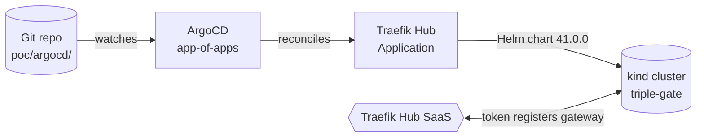

# Bootstrap (M0)

The foundation: a local Kubernetes cluster, **ArgoCD** for GitOps, and **Traefik Hub** installed as the product's real **OSS → Hub** expansion motion — performed here as a *git commit ArgoCD reconciles*. After this milestone, every gate is added declaratively and watched by ArgoCD.



## M0.1 — Cluster

A single-node **kind** cluster, with host ports 80/443/8000 mapped to NodePorts so Traefik is reachable from the browser. Creation is idempotent.

```{ .sh .terminal }
$ ./poc/scripts/00-bootstrap-cluster.sh
```

```text title="Expected output"
🚀 Creating kind cluster 'triple-gate'...
NAME                        STATUS   ROLES           AGE   VERSION
triple-gate-control-plane   Ready    control-plane   28s   v1.36.1
```

Inject the Hub + NVIDIA tokens from the gitignored `.env` as Kubernetes Secrets (nothing is printed or committed):

```{ .sh .terminal }
$ ./poc/scripts/load-secrets.sh
```

```text title="Expected output"
✅ secret traefik/traefik-hub-license set
✅ secret apps/nvidia-nim set
```

## M0.2 — ArgoCD

Installed via the pinned Helm chart `argo/argo-cd` **9.5.21** (ArgoCD v3.4.3), in insecure mode for local port-forward access.

```{ .sh .terminal }
$ ./poc/scripts/01-install-argocd.sh
```

Open the UI (prints the admin password, then port-forwards to `http://localhost:8080`, user `admin`):

```{ .sh .terminal }
$ ./poc/scripts/argocd-ui.sh
```

## M0.3 — Traefik: OSS → Hub, the GitOps way

You chose **app-of-apps**, so a root Application watches `poc/argocd/apps/` and reconciles everything it finds there.

```{ .sh .terminal }
$ kubectl apply -f poc/argocd/root-app.yaml
```

```text title="Expected output"
NAME               SYNC STATUS   HEALTH STATUS
traefik            Synced        Healthy
triple-gate-root   Synced        Healthy
```

### Phase 1 — pure OSS

The first `traefik` Application installs the **OSS** Traefik chart (`traefik/traefik` **41.0.0**, proxy v3.7.5) with **no** `hub.token`. It comes up as a plain ingress controller:

```{ .sh .terminal }
$ kubectl -n traefik get pods
$ curl -s -o /dev/null -w '%{http_code}\n' http://localhost:80/
```

```text title="Expected output"
traefik-...   1/1   Running
404
```

A `404` here is healthy — Traefik is answering, it just has no routes yet. The image is `traefik:v3.7.5` (no Hub).

!!! note "kind networking gotcha"
    In chart v41 the Service type lives at **`service.spec.type`** (default `LoadBalancer`). On kind a `LoadBalancer` stays `<pending>` forever, so we set `service.spec.type: NodePort`. Also note the **app-of-apps propagation order**: editing `apps/traefik.yaml` requires the *root* app to sync first (updating the child Application's values), then the child re-syncs the chart.

### Phase 2 — the OSS → Hub upgrade

The expansion motion is a single edit: add the `hub` block to the same Application. The value of `hub.token` is the **name** of the Secret created by `load-secrets.sh`.

```yaml title="poc/argocd/apps/traefik.yaml" hl_lines="3 4 5 6 7"
helm:
  valuesObject:
    hub:
      token: traefik-hub-license   # Secret name (key 'token') — enables API Gateway
      aigateway:
        enabled: true              # requires AI entitlement on the token
      mcpgateway:
        enabled: true              # requires MCP entitlement on the token
```

Commit it, and ArgoCD reconciles the upgrade — Traefik redeploys as a **Hub gateway** and registers with Traefik Hub:

```{ .sh .terminal }
$ git commit -am "OSS->Hub upgrade — add hub.token" && git push
$ kubectl -n traefik logs deploy/traefik | grep -i hub
```

```text title="Expected output"
INF Successfully acquired lease   lock=traefik/traefik-hub-lease-lock
```

The lease acquisition (and the absence of any token/entitlement error) confirms the gateway connected. In the **Traefik Hub dashboard**, the gateway flips from *"no gateway connected"* to online.

### Entitlement check

Enabling `hub.aigateway` and `hub.mcpgateway` with the gateway staying **healthy, 0 restarts, no rejection** confirms the trial token carries **AI + MCP** entitlements. The Hub CRDs appear, including `aiservices.hub.traefik.io` (Gate 2) and `accesscontrolpolicies.hub.traefik.io` (Gate 3 TBAC).

```{ .sh .terminal }
$ kubectl get crd | grep hub.traefik.io
```

!!! tip "Teardown"
    `./poc/scripts/teardown.sh` deletes the cluster cleanly. `colima stop` shuts down the runtime VM.

## Versions pinned in M0

| Component | Version |
| --- | --- |
| kind node (Kubernetes) | v1.36.1 |
| ArgoCD (chart `argo/argo-cd`) | 9.5.21 (app v3.4.3) |
| Traefik (chart `traefik/traefik`) | 41.0.0 (proxy v3.7.5) |
