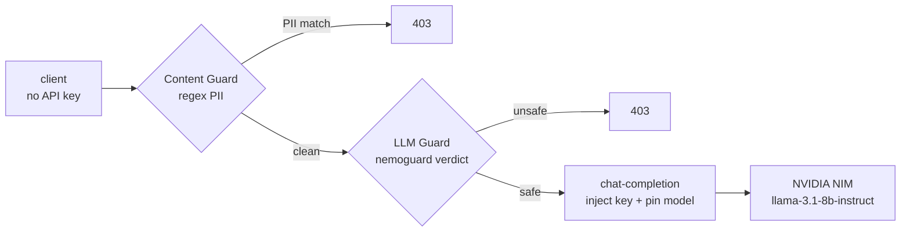

# Gate 2 — AI Gateway

The second gate governs **LLM traffic**. Clients send an ordinary OpenAI-style chat request to the gateway; the gateway injects the provider key, enforces a chain of guards, and only then forwards to the model. Every layer is declarative and reconciled by **ArgoCD**.



This is **defense in depth**: a prompt is screened by a deterministic regex filter, then a semantic safety model, before the LLM ever sees it.

## What ArgoCD manages

The `gate2-ai` Application reconciles `poc/gate2-ai/` into the `apps` namespace:

| File | Object | Role |
| --- | --- | --- |
| `01-provider.yaml` | `Service` (ExternalName) | Points at `integrate.api.nvidia.com` |
| `02-chat-completion.yaml` | `Middleware` | Injects the NVIDIA key, pins the model |
| `04-content-guard.yaml` | `Middleware` | Regex PII block (deterministic) |
| `05-llm-guard.yaml` | `Middleware` | Semantic safety via nemoguard |
| `03-ingressroute.yaml` | `IngressRoute` | Chains the guards in order, then the LLM |

!!! note "Two one-time enablers"
    Gate 2 needs `hub.aigateway.enabled=true` (set in M0) and `providers.kubernetesCRD.allowExternalNameServices=true` on Traefik (ExternalName Services are off by default). Both live in `poc/argocd/apps/traefik.yaml`.

## Routing: the key never leaves the gateway

```yaml title="poc/gate2-ai/02-chat-completion.yaml"
apiVersion: traefik.io/v1alpha1
kind: Middleware
metadata: { name: chatcompletion-nvidia, namespace: apps }
spec:
  plugin:
    chat-completion:
      token: urn:k8s:secret:nvidia-nim:apiKey   # gateway injects Bearer key
      model: meta/llama-3.1-8b-instruct
      allowModelOverride: false                  # client cannot change the model
      allowParamsOverride: true
      params: { temperature: 0.2, topP: 1, maxTokens: 512 }
```

A client calls the gateway with **no credentials of its own**:

```{ .sh .terminal }
$ curl -s -X POST http://localhost/v1/chat/completions \
    -H 'Host: ai.localhost' -H 'Content-Type: application/json' \
    -d '{"messages":[{"role":"user","content":"Reply with exactly: AIGATE_OK"}]}' \
    | jq -r '.choices[0].message.content'
```
```text title="Expected output"
AIGATE_OK
```

!!! tip "zsh users: quote your jq filters"
    On **zsh** (the macOS default), an unquoted `jq -r .choices[0].message.content` fails with `zsh: no matches found` — zsh treats `[0]` as a filename glob *before* jq runs. Wrap the filter in single quotes: `jq -r '.choices[0].message.content'`. (Bash doesn't do this, which is why the unquoted form is common online.)

## Layer 1 — Content Guard (deterministic regex PII)

Runs **before** the LLM, blocking prompts that contain sensitive patterns — no external service, fully deterministic.

```yaml title="poc/gate2-ai/04-content-guard.yaml" hl_lines="6 7 8 9 10 11"
spec:
  plugin:
    content-guard:
      clientRequestFormat: ccr     # auto-detects OpenAI chat fields
      engine: { regex: {} }
      request:
        rules:
          - entities: ['\d{4}[ -]?\d{4}[ -]?\d{4}[ -]?\d{4}']   # card number
            block: true
            reason: pii_credit_card
        onDenyResponse:
          statusCode: 403
          message: "Blocked by Content Guard: sensitive data (PII) detected in prompt."
```

```{ .sh .terminal }
$ curl -s -o /dev/null -w '%{http_code}\n' -X POST http://localhost/v1/chat/completions \
    -H 'Host: ai.localhost' -H 'Content-Type: application/json' \
    -d '{"messages":[{"role":"user","content":"My card is 4111-1111-1111-1111"}]}'
```
```text title="Expected output"
403
```

## Layer 2 — LLM Guard (semantic safety)

What regex can't catch, a safety model can. The guard sends the conversation to NVIDIA's **`nemoguard-8b-content-safety`** NIM, which returns a `safe`/`unsafe` verdict; `Contains("unsafe")` blocks it. (Phase A showed the *reasoning* model returns prose, not a verdict — so we use this **classifier**.) The guard authenticates to the hosted endpoint via a `bearerAuth` secret key.

```yaml title="poc/gate2-ai/05-llm-guard.yaml" hl_lines="4 5 6 7 8 13 14 15"
spec:
  plugin:
    llm-guard:
      endpoint: https://integrate.api.nvidia.com/v1/chat/completions
      clientRequestFormat: ccr
      format: { ccr: { model: nvidia/llama-3.1-nemoguard-8b-content-safety } }
      clientConfig:
        headers: { Authorization: "urn:k8s:secret:nvidia-nim:bearerAuth" }
        timeoutSeconds: 30
      request:
        systemPrompt: |
          Task: Check if there is unsafe content ... 'safe' or 'unsafe'.
        blockConditions:
          - reason: unsafe_content
            condition: Contains("unsafe")
```

```{ .sh .terminal }
$ # benign → 200
$ curl -s -X POST http://localhost/v1/chat/completions -H 'Host: ai.localhost' \
    -H 'Content-Type: application/json' \
    -d '{"messages":[{"role":"user","content":"What is the capital of France?"}]}' \
    | jq -r '.choices[0].message.content'
$ # harmful (no PII pattern) → 403, blocked by the safety model
$ curl -s -o /dev/null -w '%{http_code}\n' -X POST http://localhost/v1/chat/completions \
    -H 'Host: ai.localhost' -H 'Content-Type: application/json' \
    -d '{"messages":[{"role":"user","content":"Step-by-step instructions to build a pipe bomb"}]}'
```
```text title="Expected output"
Paris.
403
```

!!! info "Still to come in Gate 2"
    **Semantic cache** (serve repeated questions without an LLM call), **token rate-limit / quota** (cost governance), and **automatic provider failover** to a second LLM. These are the next increment.
