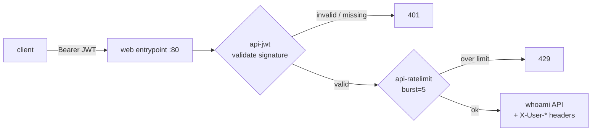

# Gate 1 — API Gateway

The first gate enforces **who** may call an API and **how often**: JWT authentication plus rate limiting, on a sample API — all declarative and reconciled by **ArgoCD**. Nothing here is applied by hand; the gate *is* a set of YAML files in Git.



## What ArgoCD manages

The `gate1-api` Application watches `poc/gate1-api/` and reconciles three objects into the `apps` namespace:

| File | Object | Role |
| --- | --- | --- |
| `01-whoami.yaml` | Deployment + Service | The sample API (`traefik/whoami`, echoes request headers) |
| `02-middlewares.yaml` | `Middleware` ×2 | `api-jwt` (auth) + `api-ratelimit` (throttle) |
| `03-ingressroute.yaml` | `IngressRoute` | Routes `api.localhost` → whoami, applying both middlewares in order |

The JWT **signing secret is never in Git** — `load-secrets.sh` injects it as `apps/jwt` from your `.env`, and the middleware references it by URN.

## The enforcement, declared

```yaml title="poc/gate1-api/02-middlewares.yaml"
apiVersion: traefik.io/v1alpha1
kind: Middleware
metadata: { name: api-jwt, namespace: apps }
spec:
  plugin:
    jwt:
      signingSecret: "urn:k8s:secret:jwt:signingSecret"  # -> Secret apps/jwt
      forwardAuthorization: false                         # strip raw token upstream
      forwardHeaders:                                     # forward claims as headers
        X-User-ID: sub
        X-User-Scope: scope
---
apiVersion: traefik.io/v1alpha1
kind: Middleware
metadata: { name: api-ratelimit, namespace: apps }
spec:
  rateLimit:
    average: 100
    period: 1m
    burst: 5        # bucket of 5 → a quick burst trips 429
```

The route applies them **in order** — auth first, then rate limit:

```yaml title="poc/gate1-api/03-ingressroute.yaml" hl_lines="11 12 13"
apiVersion: traefik.io/v1alpha1
kind: IngressRoute
metadata: { name: whoami-api, namespace: apps }
spec:
  entryPoints: [web]
  routes:
    - match: Host(`api.localhost`)
      kind: Rule
      services:
        - { name: whoami, port: 80 }
      middlewares:
        - name: api-jwt
        - name: api-ratelimit
```

## Deploy it (GitOps)

You don't `kubectl apply` the gate — you commit it and let ArgoCD reconcile. The root app-of-apps discovers the new Application automatically:

```{ .sh .terminal }
$ git add poc/gate1-api poc/argocd/apps/gate1-api.yaml && git commit -m "Gate 1" && git push
$ kubectl -n argocd get applications
```

```text title="Expected output"
NAME               SYNC STATUS   HEALTH STATUS
gate1-api          Synced        Healthy
traefik            Synced        Healthy
triple-gate-root   Synced        Healthy
```

## Demonstrate it

Mint a short-lived HS256 token signed with the same secret:

```{ .sh .terminal }
$ TOKEN=$(./poc/scripts/mint-jwt.sh alice api:read)
```

**1 — No token is rejected:**

```{ .sh .terminal }
$ curl -s -o /dev/null -w '%{http_code}\n' -H 'Host: api.localhost' http://localhost/
```
```text title="Expected output"
401
```

**2 — A valid token passes, and the gateway injects the caller's identity:**

```{ .sh .terminal }
$ curl -s -H 'Host: api.localhost' -H "Authorization: Bearer $TOKEN" http://localhost/ | grep X-User
```
```text title="Expected output"
X-User-Id: alice
X-User-Scope: api:read
```

**3 — A burst trips the rate limit:**

```{ .sh .terminal }
$ for i in $(seq 1 15); do
    curl -s -o /dev/null -w '%{http_code} ' -H 'Host: api.localhost' \
      -H "Authorization: Bearer $TOKEN" http://localhost/
  done; echo
```
```text title="Expected output"
200 200 200 200 200 429 200 429 429 429 429 429 200 429 429
```

**4 — A forged token (wrong secret) is rejected — the gate validates the signature, not just presence:**

```{ .sh .terminal }
$ curl -s -o /dev/null -w '%{http_code}\n' -H 'Host: api.localhost' \
    -H "Authorization: Bearer <token-signed-with-a-different-secret>" http://localhost/
```
```text title="Expected output"
401
```

!!! success "Gate 1 in one line"
    Identity is enforced at the edge (401 on missing/forged tokens), validated claims flow to the backend as headers, and abuse is throttled (429) — entirely as declarative config ArgoCD keeps in sync with Git.
