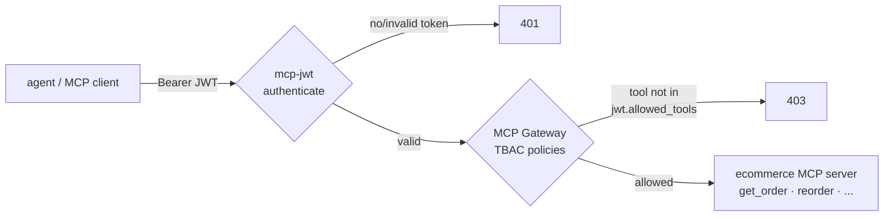

# Gate 3 — MCP Gateway

The third gate governs **AI agents**. An MCP (Model Context Protocol) server exposes business *tools*; the gateway puts JWT authentication and **Task-Based Access Control (TBAC)** in front of it, so a given identity can call only the tools it's entitled to — not just "can you reach the server", but "can you run *this* tool".



## The MCP server

A small **FastMCP** server (Streamable HTTP) embodying the [mcp-ecommerce-agent](https://yassineteimi.github.io/mcp-ecommerce-agent/) design — read tools (`get_order`, `list_inventory`) and privileged write tools (`reorder`, `approve_return`). It's built locally and side-loaded into kind (no registry):

```{ .sh .terminal }
$ ./poc/scripts/build-mcp-image.sh   # docker build + kind load
```

## What ArgoCD manages

The `gate3-mcp` Application reconciles `poc/gate3-mcp/` into `apps`:

| File | Object | Role |
| --- | --- | --- |
| `01-mcp-server.yaml` | Deployment + Service | The MCP server (Streamable HTTP `:8000/mcp`) |
| `02-mcp-jwt.yaml` | `Middleware` (jwt) | Authenticate; claims drive TBAC |
| `03-mcp-gateway.yaml` | `Middleware` (mcp) | MCP protocol + **TBAC policies** |
| `04-strip-prefix.yaml` | `Middleware` | Rewrite `/ecommerce-mcp` → `/` |
| `05-ingressroute.yaml` | `IngressRoute` | Chains the three middlewares |

## TBAC, declared

The access decision is **token-driven**: protocol/discovery methods are open to any authenticated caller, but a `tools/call` is allowed only if the tool appears in the JWT's `allowed_tools` claim.

```yaml title="poc/gate3-mcp/03-mcp-gateway.yaml" hl_lines="13 14 15"
spec:
  plugin:
    mcp:
      policies:
        - match: Equals(`mcp.method`, `initialize`)
          action: allow
        - match: Equals(`mcp.method`, `tools/list`)
          action: allow
        # ... ping, notifications/initialized, resources/list, prompts/list ...
        - match: Equals(`mcp.method`, `tools/call`) && Contains(`jwt.allowed_tools`, `${mcp.params.name}`)
          action: allow
      defaultAction: deny
```

!!! note "Two findings worth recording"
    `resourceMetadata` URLs **must be `https://`** (OAuth metadata validation), and the policy language supports `Equals` / `Contains` / `Lte` but **not `NotEquals`** — so the protocol methods are allow-listed explicitly.

## Demonstrate it

Two identities, same secret, different `allowed_tools` claim:

```{ .sh .terminal }
$ SUPPORT=$(./poc/scripts/mint-mcp-jwt.sh support get_order,list_inventory)
$ OPS=$(./poc/scripts/mint-mcp-jwt.sh ops get_order,list_inventory,reorder,approve_return)
```

**No token is rejected at the edge:**

```{ .sh .terminal }
$ curl -s -o /dev/null -w '%{http_code}\n' -X POST http://mcp.localhost/ecommerce-mcp/mcp \
    -H 'Content-Type: application/json' -H 'Accept: application/json, text/event-stream' \
    -d '{"jsonrpc":"2.0","id":1,"method":"initialize","params":{}}'
```
```text title="Expected output"
401
```

The demo client needs the `mcp` SDK (Python 3.10+). The wrapper bootstraps a
dedicated venv on first run, so just call it directly:

!!! note "macOS: it's `python3`, not `python`"
    macOS ships only `python3` (and its system one is 3.9, too old for `mcp`). The `mcp-call.sh` wrapper handles this — it creates a `.venv-mcp` with a suitable Python and the SDK, so you never invoke `python` yourself.

**Support can read, but not write:**

```{ .sh .terminal }
$ ./poc/scripts/mcp-call.sh "$SUPPORT" get_order '{"order_id":"88213"}'
$ ./poc/scripts/mcp-call.sh "$SUPPORT" reorder  '{"sku":"SKU-BLU-42","qty":50}'
```
```text title="Expected output"
ALLOWED get_order -> {"status": "delayed", "reason": "driver called in sick", ...}
DENIED reorder -> HTTP 403 (blocked by gateway TBAC/JWT)
```

**Ops can do both:**

```{ .sh .terminal }
$ ./poc/scripts/mcp-call.sh "$OPS" reorder '{"sku":"SKU-BLU-42","qty":50}'
```
```text title="Expected output"
ALLOWED reorder -> {"ok": true, "sku": "SKU-BLU-42", "new_level": 50}
```

!!! success "Gate 3 in one line"
    The same MCP server, the same network path — yet the gateway lets *support* read orders and blocks it from `reorder`, while *ops* may do both. Authorization is per-tool, per-identity, and entirely declarative.
