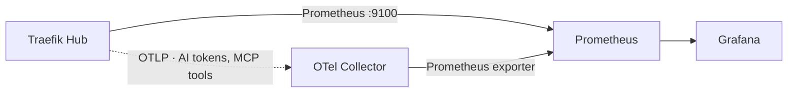

# Observability

Observability is first-class here, not an afterthought: every gate's decisions are
visible as metrics. Traefik exposes **Prometheus** metrics for request flow (so a
guard block shows up as a `403` on a specific route), and **OpenTelemetry** metrics
for AI token usage and MCP tool calls. The whole stack is GitOps-managed.



## What ArgoCD manages

| Application | Chart / source | Role |
| --- | --- | --- |
| `observability-prometheus` | prometheus 29.13.0 | Scrapes Traefik (`:9100`) + the collector |
| `observability-grafana` | grafana 10.5.15 | Dashboards (Prometheus datasource) |
| `observability-dashboards` | `poc/observability/` | The Triple Gate dashboard (ConfigMap) |

Traefik itself is told to emit per-route labels and advertise a scrape target:

```yaml title="poc/argocd/apps/traefik.yaml" hl_lines="4 5 6 7 11"
metrics:
  prometheus:
    addEntryPointsLabels: true
    addRoutersLabels: true      # per-route metrics → guard hits per gate
    addServicesLabels: true
deployment:
  podAnnotations:
    prometheus.io/scrape: "true"
    prometheus.io/port: "9100"
    prometheus.io/path: /metrics
```

!!! note "A real gotcha"
    `podAnnotations` lives under **`deployment.podAnnotations`** in chart v41 — putting it at the root makes the Helm values fail schema validation, which surfaces in ArgoCD as a `ComparisonError` / **`SYNC=Unknown`** and silently blocks *all* of that app's changes. If an app won't apply a value, check `kubectl -n argocd get application <name> -o jsonpath='{.status.conditions}'`.

## Open it

```{ .sh .terminal }
$ ./poc/scripts/grafana-ui.sh        # http://localhost:3000  (admin/admin)
```

Dashboard **Traefik Triple Gate** has request rate by route, **blocked-by-gate
(401/403)**, allowed vs blocked counters, and p95 latency.

## What the gates look like in metrics

After running the [unified demo](unified-demo.md), the per-route counters show each
gate doing its job — the same evidence, now as telemetry:

Prometheus runs inside the cluster, so open a port-forward first (in a separate
terminal — it keeps running), **then** query it:

```{ .sh .terminal }
$ ./poc/scripts/prometheus-ui.sh        # forwards http://localhost:9090 — leave running
```

```{ .sh .terminal }
$ # in another terminal: blocked requests by route + code
$ curl -sG http://localhost:9090/api/v1/query \
    --data-urlencode 'query=sum by (router,code) (traefik_router_requests_total{code=~"401|403"})' \
    | jq -r '.data.result[] | .metric.router + "  " + .metric.code + "  " + .value[1]'
```
```text title="Observed (after running the unified demo)"
apps-whoami-api-…       401   6    # Gate 1: anonymous/forged rejected
apps-ai-gateway-…       403   6    # Gate 2: Content Guard + LLM Guard blocks
apps-ecommerce-mcp-…    403   6    # Gate 3: TBAC tool denials
```

!!! warning "Empty result? Check the port-forward"
    `curl http://localhost:9090/...` returning nothing almost always means **no port-forward is running** (connection refused) — Prometheus isn't exposed on the host by default. Run `prometheus-ui.sh` first. The same applies to Grafana (`grafana-ui.sh`, `:3000`).

!!! info "Next increment (M5.2)"
    An **OpenTelemetry Collector** to surface `gen_ai.client.token.usage` (AI token
    counts/cost) and `mcp.client.operation.duration` (tool-call decisions by
    `mcp.tool.name`), with Grafana panels — plus captured **screenshots** and a
    written findings section on what Traefik's observability does well and where it
    falls short.
