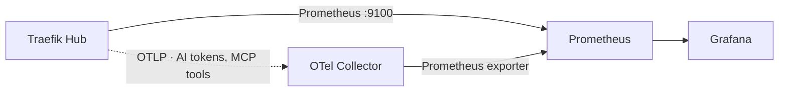
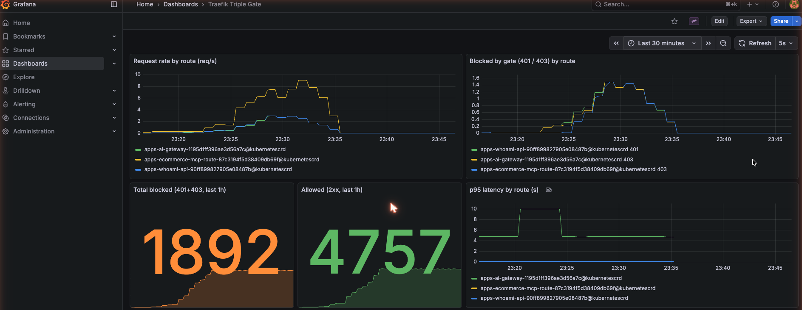
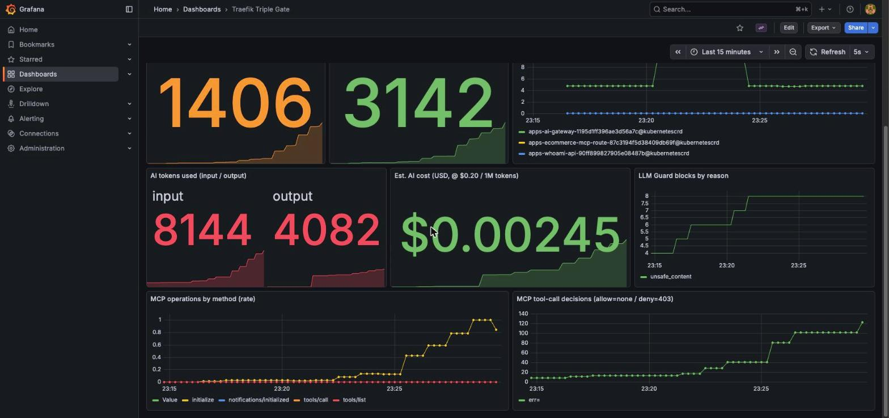

# Observability

Observability is first-class here, not an afterthought: every gate's decisions are
visible as metrics. Traefik exposes **Prometheus** metrics for request flow (so a
guard block shows up as a `403` on a specific route), and **OpenTelemetry** metrics
for AI token usage and MCP tool calls. The whole stack is GitOps-managed.



## What ArgoCD manages

| Application | Chart / source | Role |
| --- | --- | --- |
| `observability-prometheus` | prometheus 29.13.0 | Scrapes Traefik (`:9100`) + the collector |
| `observability-grafana` | grafana 10.5.15 | Dashboards (Prometheus datasource) |
| `observability-dashboards` | `poc/observability/` | The Triple Gate dashboard (ConfigMap) |
| `observability-otel` | opentelemetry-collector 0.158.2 | Bridges Traefik OTLP (AI/MCP metrics) → Prometheus |

Traefik itself is told to emit per-route labels and advertise a scrape target:

```yaml title="poc/argocd/apps/traefik.yaml" hl_lines="4 5 6 7 11"
metrics:
  prometheus:
    addEntryPointsLabels: true
    addRoutersLabels: true      # per-route metrics → guard hits per gate
    addServicesLabels: true
deployment:
  podAnnotations:
    prometheus.io/scrape: "true"
    prometheus.io/port: "9100"
    prometheus.io/path: /metrics
```

!!! note "A real gotcha"
    `podAnnotations` lives under **`deployment.podAnnotations`** in chart v41 — putting it at the root makes the Helm values fail schema validation, which surfaces in ArgoCD as a `ComparisonError` / **`SYNC=Unknown`** and silently blocks *all* of that app's changes. If an app won't apply a value, check `kubectl -n argocd get application <name> -o jsonpath='{.status.conditions}'`.

## Open it

```{ .sh .terminal }
$ ./poc/scripts/grafana-ui.sh        # http://localhost:3000  (admin/admin)
```

Dashboard **Traefik Triple Gate** has request rate by route, **blocked-by-gate
(401/403)**, allowed vs blocked counters, and p95 latency.

## What the gates look like in metrics

After running the [unified demo](unified-demo.md), the per-route counters show each
gate doing its job — the same evidence, now as telemetry:

Prometheus runs inside the cluster, so open a port-forward first (in a separate
terminal — it keeps running), **then** query it:

```{ .sh .terminal }
$ ./poc/scripts/prometheus-ui.sh        # forwards http://localhost:9090 — leave running
```

```{ .sh .terminal }
$ # in another terminal: blocked requests by route + code
$ curl -sG http://localhost:9090/api/v1/query \
    --data-urlencode 'query=sum by (router,code) (traefik_router_requests_total{code=~"401|403"})' \
    | jq -r '.data.result[] | .metric.router + "  " + .metric.code + "  " + .value[1]'
```
```text title="Observed (after running the unified demo)"
apps-whoami-api-…       401   6    # Gate 1: anonymous/forged rejected
apps-ai-gateway-…       403   6    # Gate 2: Content Guard + LLM Guard blocks
apps-ecommerce-mcp-…    403   6    # Gate 3: TBAC tool denials
```

!!! warning "Empty result? Check the port-forward"
    `curl http://localhost:9090/...` returning nothing almost always means **no port-forward is running** (connection refused) — Prometheus isn't exposed on the host by default. Run `prometheus-ui.sh` first. The same applies to Grafana (`grafana-ui.sh`, `:3000`).

## AI & MCP metrics via OpenTelemetry

Traefik exposes request metrics on the Prometheus endpoint, but the **AI- and
MCP-specific** metrics are emitted over **OTLP** only. An OpenTelemetry Collector
receives them and re-exposes them to Prometheus. What arrives is richer than
expected — it follows the OpenTelemetry **GenAI semantic conventions**.

### Implementation

**1 — Point Traefik's OTLP metrics exporter at the collector** (added to the same
`traefik` Application values):

```yaml title="poc/argocd/apps/traefik.yaml"
metrics:
  otlp:
    enabled: true
    http:
      enabled: true
      endpoint: http://otel-collector.observability.svc.cluster.local:4318/v1/metrics
    addRoutersLabels: true
    addServicesLabels: true
```

**2 — Run the collector** (`contrib` image — it has the `prometheus` exporter):
OTLP in on `:4318`, Prometheus out on `:8889`, scraped via a pod annotation.

```yaml title="poc/argocd/apps/observability-otel.yaml"
config:
  receivers:
    otlp:
      protocols:
        http: { endpoint: 0.0.0.0:4318 }
  exporters:
    prometheus:
      endpoint: 0.0.0.0:8889
  service:
    pipelines:
      metrics: { receivers: [otlp], exporters: [prometheus] }
```

**3 — Verify delivery by querying Prometheus** (not the collector — see the warning
below). Run some AI/MCP traffic, then:

```{ .sh .terminal }
$ ./poc/scripts/prometheus-ui.sh    # separate terminal
$ curl -sG http://localhost:9090/api/v1/query \
    --data-urlencode 'query=sum by (gen_ai_token_type) (gen_ai_client_token_usage_sum)' \
    | jq -r '.data.result[] | .metric.gen_ai_token_type + " = " + .value[1]'
```
```text title="Observed"
input = 942
output = 167
```

!!! warning "Confirm OTLP delivery in Prometheus, not the collector"
    During bring-up the collector's in-pod `:8889` endpoint can read as *empty*
    even while data flows (a `busybox wget` quirk). The reliable check is querying
    **Prometheus**. To prove the collector is *receiving*, add a `debug` exporter
    (`verbosity: detailed`) to the metrics pipeline and watch its logs — that's how
    this PoC confirmed Traefik was emitting all along — then remove it. Note the
    collector pod must be **restarted** (`kubectl rollout restart`) to pick up a
    config change.

### Metrics emitted

| Metric (Prometheus name) | What it gives us |
| --- | --- |
| `gen_ai_client_token_usage_sum` | Input/output **token counts** by model — drives a **cost** estimate |
| `gen_ai_client_operation_duration_seconds` | LLM call latency |
| `traefik_hub_llm_guard_requests_total{reason}` | **LLM Guard blocks by reason** (e.g. `unsafe_content`) |
| `mcp_client_operation_duration_seconds_count{mcp_method_name,error_type}` | **MCP tool-call decisions** (allow vs `error_type="403"`) |

Observed live after traffic:

```text title="Observed"
AI tokens         input = 942   output = 167
Est. AI cost      ≈ $0.0002  (@ $0.20 / 1M tokens)
LLM Guard blocks  reason="unsafe_content" = 3
```

The Grafana dashboard adds panels for token usage, estimated cost, LLM Guard
blocks by reason, and MCP operations by method/decision.

## Findings (honest assessment)

**Strong:**

- **Standards-first.** AI metrics use the OTel **GenAI semantic conventions**
  (`gen_ai.token.type`, `gen_ai.request.model`, …), so token usage and cost are
  vendor-neutral and portable — not a proprietary shape.
- **Governance-grade signals out of the box.** Token usage → cost, **guard blocks
  by reason**, and per-tool MCP decisions are exactly what a regulated buyer needs
  for AI cost control and audit.
- Request metrics carry per-route labels, so each gate's blocks (401/403) are
  directly visible without custom instrumentation.

**Rough edges (worth flagging):**

- The AI/MCP metrics are **OTLP-only** — you *must* run a collector to get them
  into Prometheus; they aren't on Traefik's Prometheus endpoint. Expect that extra
  hop.
- **Content Guard** has no obvious dedicated counter like LLM Guard's
  `..._requests_total{reason}`; its blocks are only visible as `403` on the route.
- On a denied MCP `tools/call`, `mcp_tool_name` isn't always populated (the request
  is rejected before tool resolution), so deny-by-tool charts lean on `error_type`
  + the route's `403`.
- Operational gotchas (documented inline): `deployment.podAnnotations` (not root),
  the collector needs a restart to pick up config, and querying the in-pod
  exporter directly can mislead — **query Prometheus**, not the collector's
  `:8889`, to confirm delivery.

## The dashboard

Captured after sustained traffic through all three gates.

**Request flow & gate enforcement** — request rate per route, blocked-by-gate
(401/403), allowed vs blocked, and p95 latency:



**AI & agent governance** — token usage (input/output), estimated cost, LLM Guard
blocks by reason, and MCP operations / tool-call decisions:



!!! tip "Reproduce the screenshots"
    `./poc/scripts/grafana-ui.sh`, then in another terminal run traffic for a minute
    (`./poc/scripts/unified-demo.sh` a few times, or a `curl` loop), and the panels
    fill in. The `rate()` panels use a **5-minute** window because Prometheus scrapes
    every ~60s — a `[1m]` window only catches one sample and reads "No data".
