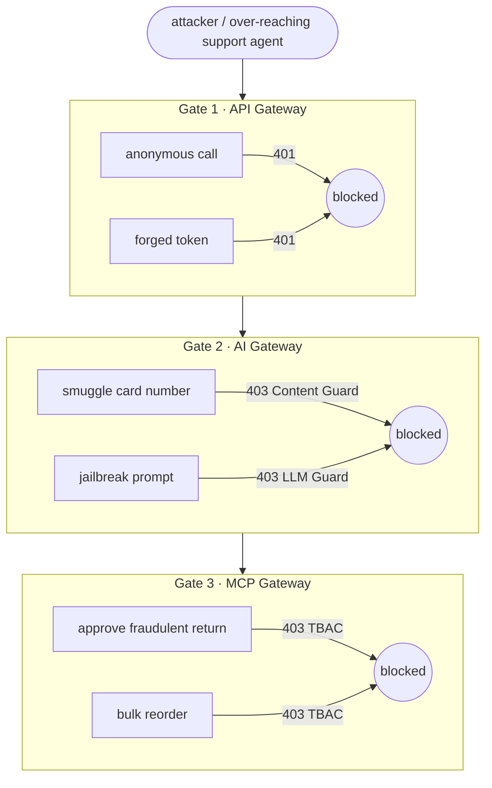

# Unified Demo

One attacker, one narrative, three gates. This scenario shows **defense in depth**: a malicious step blocked at one gate would still be caught at the next, and each gate refuses a *different* class of abuse, yet legitimate traffic flows throughout.

## The scenario: "the over-reaching support agent"

A **support**-tier identity (or an attacker holding a stolen support token) tries to escalate from read-only help into **data exfiltration** and **privileged actions**. Each move is stopped at a different layer.



## Run it

```{ .sh .terminal }
$ ./poc/scripts/unified-demo.sh
```

```text title="Captured evidence"
ACT 1 - Gate 1 (API Gateway): identity at the edge
  ✓ BLOCKED  anonymous API call rejected (HTTP 401)
  ✓ BLOCKED  forged token (wrong signature) rejected (HTTP 401)
  ✓ ALLOWED  legitimate support token admitted (HTTP 200)

ACT 2 - Gate 2 (AI Gateway): governing the LLM
  ✓ BLOCKED  PII (card number) blocked by Content Guard before the LLM (HTTP 403)
  ✓ BLOCKED  jailbreak/harmful prompt blocked by LLM Guard (HTTP 403)
  ✓ ALLOWED  legitimate question answered: "Infrastructure."

ACT 3 - Gate 3 (MCP Gateway): authorizing agent actions
  ✓ BLOCKED  support agent denied approve_return - HTTP 403 (TBAC)
  ✓ BLOCKED  support agent denied bulk reorder - HTTP 403 (TBAC)
  ✓ ALLOWED  support agent may still read orders (least privilege intact)
  ✓ ALLOWED  authorized ops identity may reorder (it's authz, not breakage)

Result: every malicious step was stopped at a different gate. Defense in depth.
```

## Why this is "defense in depth", not just three filters

Each gate addresses a failure the others can't see:

| Attack | Stopped by | What the other gates would miss |
| --- | --- | --- |
| Anonymous / forged access | **Gate 1** JWT | The AI/MCP gates never even get the request |
| Exfiltrating PII via a prompt | **Gate 2** Content Guard | A valid token (Gate 1) passes; the regex catches the card number |
| Jailbreak to harmful output | **Gate 2** LLM Guard | Deterministic regex can't judge intent; the safety model can |
| Agent coerced into a privileged action | **Gate 3** TBAC | The prompt may be "clean"; only per-tool authz stops the *action* |

The last row is the crux of the prompt-injection threat: even if an attacker fully **owns the agent's reasoning**, the MCP Gateway still refuses a tool the identity isn't entitled to. Authorization is enforced at the gate, not trusted to the model.

!!! success "The headline"
    A compromised agent is not a compromised system. Identity is checked at the edge, content and intent are screened before the model, and **actions are authorized per-tool per-identity**, so the blast radius of any single failure is bounded by the next gate.
